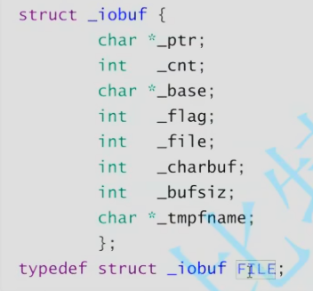
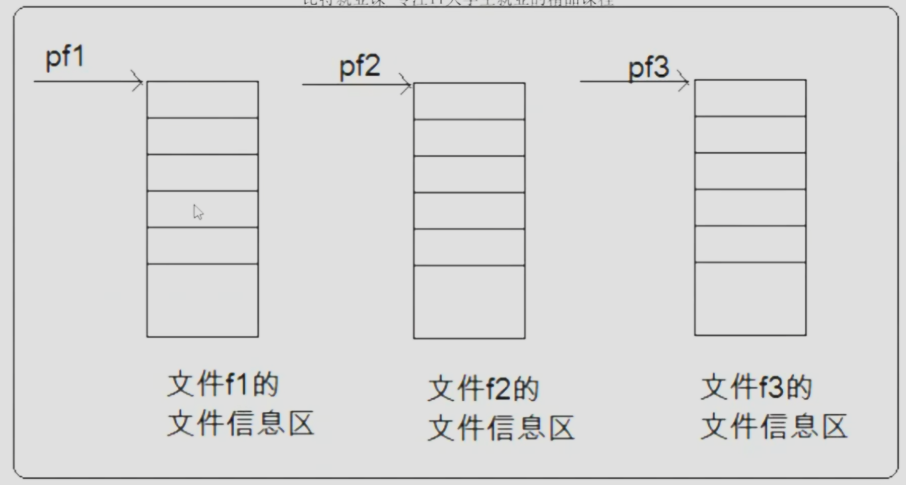

# C_code
files

---
1. 为什么使用文件
2. 什么是文件
3. 文件的打开和关闭
4. 文件的顺序读写
5. 文件的随机读写
6. 文本文件和二进制文件
7. 文件读取结束的判定
8. 文件缓冲区

---

## 一、使用文件的原因：

将数据直接保存在`电脑硬盘`上，实现数据的==持久化==

## 二、什么是文件

`硬盘上的文件`才是文件

程序设计中文件包括`程序文件`与`数据文件`

- 程序文件 ：包括`源程序文件`（如.c文件）、`目标文件`（如.obj文件 ）、`可执行程序文件`（如.exe文件）

- 数据文件：程序运行时读写的数据

- 源程序执行流程：数据文件 --读(输入)--> .c程序 --写(输出)--> 程序文件

- 文件名：文件的唯一文件标识，便于用户识别引用

    由三部分组成：`文件路径` + `文件名主干` + `文件后缀`
    例如 c:\code\test.c

## 三、文件的打开与关闭

文件操作流程：打开文件 --> 操作文件 --> 关闭文件

- `文件指针`
  
  每个被使用的文件都会在内存中开辟一个相应`文件信息区`用于存放文件相关信息
  文件信息包括`文件名`、`文件状态`、`文件路径`
  这些信息将保存在一个`结构体变量`中，该结构体由系统声明，标签为**FILE.**
    
    
    最后使用typedef 重命名为`FILE`.

    使用库函数`fopen`打开文件时会返回FILE类型结构体的起始地址，我们称此地址为文件指针

    FILE* pf //创建一个文件指针变量

     pf指针是一个指向FILE类型数据的指针变量，通过pf指针指向不同文件信息区来访问该文件，也就是**可以实现通过文件指针变量找到与其关联的文件**
    

-  文件的打开与关闭：

    文件打开的同时会返回一个 FILE* 类型的指针变量指向该文件信息区的首地址

    ANSIC规定使用`fopen`来打开文件，`fclose`来关闭文件

    文件打开
    >FILE * fopen( const char * filename, const char * mode)

    文件关闭：
    > int fclose ( FILE * stream )

    - fopen函数：
    FILE * fopen( const char * filename, const char * mode)

    先指定文件名，再指定文件打开形式
        文件的打开形式：
        1. `"r"` read 读数据，文件必须存在
        2. `"w"` write 写数据，如果文件夹不存在将创造一个文件
        3. `r+` update文件，文件必须存在
        4. `w+` 创建新文件来更新/或覆盖原有文件
        5. `a+` ...

    > eg:
    FILE* pf = fopen("test.c", "w")

    如果该文件不存在，即打开失败,fopen函数会返回空指针，建议在打开后判断

    `if (pf == NULL)`

    可以引入头文件`errno.h`+`string.h`来实现对错误信息的打印
    > eg:
    >/* strerror example : error list */
    #include <stdio.h>
    #include <string.h>
    #include <errno.h>

    >int main ()
    {
    FILE * pFile;
    pFile = fopen ("unexist.ent","r");
    if (pFile == NULL)
        printf ("Error opening file unexist.ent: %s\n",strerror(errno));
    fclose(pf)
    return 0;

    }

    若文件不存在，将会打印错误信息：**Error opening file unexist.ent: No such file or directory**

    - fclose函数：
    
    使用例：
    fclose(pf);
    pf = NULL;// 需要初始化创建的指针以释放

    文件默认路径为`项目根目录`，为相对路径

    如果想打开其他位置的路径需要以`绝对路径`形式打开
    eg: "D:\\OneCloud\\test.c"

    注：**此处字符串中反斜杠需要使用转义字符**

